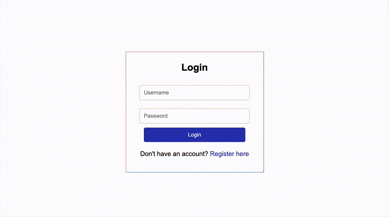

# Spring Framework Final Project

Secure Online Quiz Application

## Details

This project is created with Spring Web, Thymeleaf, and Spring Security as it's dependencies.

### Task 1: Install the Tools

Install all the tools required for developing a Spring MVC project

### Task 2: Initialize the Project

Use Spring Initializr to generate a Spring Boot project with dependencies for Spring Web, Thymeleaf, and Spring Security

### Task 3: Create the folders to organize the code

Create model, controller, service, and config folders under the appropriate package structure

### Task 4: Create User class

Create a class named `User` in the model folder

### Task 5: Create Question class

Create a class named `Question` in the model folder

### Task 6: Create service class for the users

Create `QuizUserDetailsService` class with a data structure to store the user details in memory in the service layer

### Task 7: Create service class for the questions

Create `QuestionService` class with a data structure to store the questions in memory in the service layer

### Task 8: Create a controller to provide endpoints

Create `QuizController` class to handle HTTP requests and define application endpoints

### Task 9: Create a class to protect endpoints

Create `WebSecurityConfig` class that authenticates and authorizes the endpoints according to the user roles

### Task 10: Create user interface

Create the HTML files using Thymeleaf templates for the application interface

### Task 11: Create the runnable jar file

Create the runnable jar file. You will be submitting this file for peer evaluation.

A sample application login screen can be seen below:



### Install the tools and initialize the project

1. Install the Spring Initializr Java Support extension required for developing a Spring MVC project.
2. Generate a Spring Boot project using Spring Initializr with dependencies for Spring Web, Thymeleaf, and Spring Security.
3. Open the pom.xml file and verify that the packaging is set to jar. You must generate the jar file for submission.

```
	<version>0.0.1-SNAPSHOT</version>
    <packaging>jar</packaging>
```

4. Hover over the highlighted links on pom.xml and click. A suggestion appears, make sure to click on Quick Fix.
5. Click to download the xsd file.

### Create the folders to organize the code

Create the following folders under the appropriate package structure for your application:

- `model` to store your data models
- `controller` to implement the Controller that provides the REST API endpoints
- `service` to contain the service class that handles user details
- `config` to house the Configuration class that manages endpoints security

### Create User and Question Class

1. Create a class named `User` under the `model` folder with these attributes:

- username
- email
- password
- role

Implement overloaded constructors. Encapsulate the attribute and provide setters and getters. Include a toString method to return the string representation of the class.

Note: Consider which attributes you should exclude from the toString method. Not all user details should be displayed.

2. Create a class named `Question` under the `model` folder with these attributes:

- id (int)
- questionText (String)
- options (ArrayList)
- correctAnswer (String)

Implement overloaded constructors. Encapsulate the attributes and provide setters and getters. Include a toString method to return the string representation of the class.

### Create service class for the users and questions

1. Create `QuizUserDetailsService` class. Use a data structure to store user details in the service layer. Define and implement these methods:

- loadUserByUsername: Returns `UserDetails` object when provided with username and password
- registerUser: Registers a new user with username, password, email, and role

2. Create `QuestionsService` class. Use a data structure (Suggestion: HashMap) to store questions in memory within the service layer. Define and implement these methods:

- `loadQuizzes`: Returns a List
- `addQuiz`: Accepts a Question object as a parameter and adds it to the collection.
- `editQuiz`: Accepts a Question object as a parameter and updates the corresponding Question in the collection
- `deleteQuiz`: Accepts a question ID and removes the corresponding question from the collection

### Create a controller to provide endpoints

Implement a controller that handles these API requests:

- GET request for retrieving the login page
- GET request for retrieving the registration page
- POST request for registering user
- GET mapping for retrieving the addQuiz page
- POST request for adding quiz questions
- GET mapping for retrieving the editQuiz page
- PUT request for editing quiz questions
- DELETE request for removing quiz questions
- GET request for retrieving quiz questions (home page - different for admin and regular users)
- POST request for submitting answers
- GET request for retrieving the result page

### Create a class to protect endpoints

Create a WebSecurityConfig class that authenticates users and authorizes endpoint access based on user roles:

- Anyone on the site is allowed access to registration and login pages
- QuizList page is allowed only for those with admin role
- Quiz page is allowed only for those with admin role
- Quiz page is allowed only for those with user role
- All other endpoints require to be authenticated

### Create the user interface

Create the following HTML files using Thymeleaf templates:

1. `Login`: Default landing page for all users with an option to access the registration page. Enforce data validation for username and password fields.
2. `Registration`: Form to collect username, password, email, and role with appropriate data validation.
3. `QuizList`: Admin view displaying all existing quizzes with edit and delete options. Include a link to the AddQuiz page.
4. `Add Quiz`: Form for admins to create new quiz questions, including answer options and correct answer designation.
5. `Edit Quiz`: Form for admins to edit quiz questions, including answer options and correct answer designation.
6. `Quiz`: Page for users to view and submit quiz answers. Users are directed to this page after logging in.
7. `Result`: Page displaying quiz results for the user.

### Create the runnable jar file

1. Run the application and test it to ensure it behaves as expected.

- Perform a `mvn clean install`, then
- Right click on `QuizApplication.java` and then select Run Java.

Checklist for your application:

- The home page should redirect to the login page when you open the app
- The login page must include a registration link.
- The registration page should contain textboxes for username and email, a password box, and a dropdown for role selection.
- After successful login, the application should direct admin users to the `QuizList` page and regular users to the `Quiz page`.
- The `QuizList` page should display all questions with `edit` and `delete` options for each, plus a link to add new quizzes.
- The `Add Quiz` page should allow editing existing questions.
- The `Edit Quiz` page should allow adding new questions.
- The `Quiz` page should list all questions with selectable options for users.
- The user should be able to submit the quiz.
- The results page should accurately display the number of correctly answered questions.

2. Create the runnable jar file

`mvn exec:java -Dexec.mainClass="com.example.quiz.QuizApplication"`
